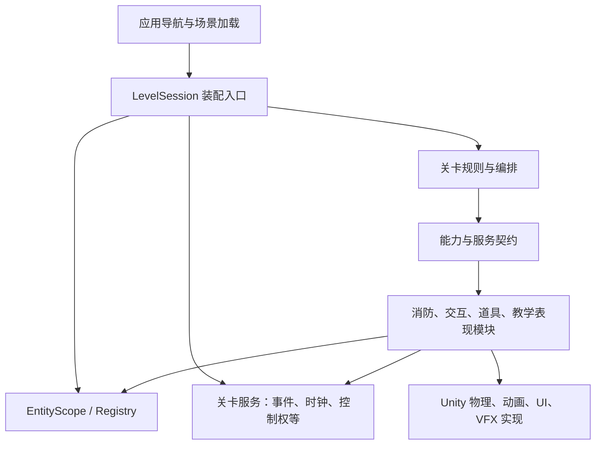

# 通用玩法组件与关卡服务集成计划

日期：2026-09-23  
状态：核心模块集成与两个隔离试点已实施，实际范围和验收见[通用玩法组件接入与实施记录](./通用玩法组件接入与实施记录.md)。本文保留原目标与验收矩阵，不以计划条目代替已完成证明。  
前置成果：[实体系统建设计划](./实体与组件系统建设计划.md)、[实施与验收记录](./实体与组件系统实施与验收记录.md)、[接入说明](./实体与组件系统接入说明.md)。

## 1. 目标与完成后的使用方式

在现有实体系统之上，把项目中已经存在、可用于不同关卡的玩法整理成可组合模块。新关卡通过配置实体、能力、服务和流程，复用火焰、灭火、交互、道具、指引、答题展示、计时、反馈、结算等系统；不再复制办公室 Controller，也不要求每关都有火源、四个选项或三题。

预期制作过程：

1. 选择场景，为参与玩法的对象配置 Entity ID、能力与槽位。
2. 在关卡配置中声明需要的模块、参数、资源和角色绑定。
3. 关卡编排调用能力、监听已发生的事实，决定提示、计分、成功/失败与下一步。
4. 校验依赖后运行；停止、异常、重开时统一取消任务、释放订阅和控制权。

“通用”指行为和契约可以跨关卡使用，不等于当前已有多个正式关卡验证。目前 `Resources/Configs/levels.json` 仍只有 `level_1_initial_fire` 一个正式条目；第三场景是灭火原型。第二套验证内容用于证明复用，不直接宣称它是已交付的新正式关卡。

## 2. 当前实现与主要缺口

现有 `HMProtection.Entities` 已提供 ID、Handle、Registry、Scope、显式能力、角色绑定、Anchor、Hit Proxy 和安装回滚。办公室实体试点有 17 个实体。上一阶段记录了 20 项 EditMode、4 项 PlayMode 及办公室主要集成流程通过；这些是历史基线，本计划实施后必须重跑，不能代替新增模块验收。

本次代码复核发现：

| 现状 | 证据入口（相对 `HMP_game/Assets/`） | 需要改变的边界 |
|---|---|---|
| 通用交互、出生准备、气泡等仍知道办公室桥接类型 | `scripts/交互/Interactor.cs`、`scripts/关卡/LevelBootstrapper.cs`、`scripts/Quiz/SceneChoicePresenter.cs` → `OfficeEntityBindings` | 改为通用 Session/绑定接口；办公室引用只留在内容装配与规则中 |
| 火势存在多个修改入口 | `LevelFlowRunner.ApplyFire`、`FireSuppression.Update/LowerOneLevel`、`FireEffectController.SetLevel` | 火源状态只由一个领域模型修改，流程和喷射都提交命令 |
| 喷射默认寻找任意一个压制对象 | `scripts/道具/ExtinguisherSpray.cs` 的 `FindAnyObjectByType<FireSuppression>` | 根据命中几何与实体归属选择本次目标 |
| 交互器同时承担输入、焦点、持物、模式和手部接线 | `scripts/交互/Interactor.cs` | 保留输入/命中入口，分离携带、座椅和提示状态 |
| 阶段计时与答题 UI 计时分离，阶段计时无推进实现 | `scripts/关卡/StageTimer.cs` 没有 Update/Tick；`scripts/Quiz/QuizTimerHUD.cs` | 一套计时服务，多条计时实例；HUD 只读状态 |
| 多处直接开关人物控制、冻结和光标 | `LevelFlowRunner`、反馈/讲解视图、玩家/座椅等 | 按原因领取和释放控制权，避免一个窗口关闭后错误解锁另一个窗口 |
| 流程与具体内容混合 | `OfficeFireChoiceFlow`、`OfficeChoiceInteraction`、`LevelFlowRunner` | 展示/交互/反馈可复用，题目判断和剧情决策属于关卡 |
| 配置和应用入口有默认全局路径 | `SceneChoiceCatalog.DefaultPath`、`ConfigLoader`、`CgTransitionPlayer` 等 | 显式关卡资源入口与应用级转场协调 |
| 视图中仍写死办公室与三题语义 | `TrainingSettlementView.Build` 中的 `OFFICE FIRE SAFETY`、`YOUR THREE DECISIONS` 及三行记录；`InstructorLessonView` 的固定分步布局 | 可替换结果模型、步骤列表和皮肤，不能只换接口而保留固定内容 |
| 全局遮罩用办公室组件判断生命周期 | `QuizLoadingOverlay` 的办公室流程检测与自动隐藏逻辑 | 改由导航/表现操作明确持有和结束，不按场景内类型猜测 |
| 障碍采集直接识别旧具体组件 | `SceneObstacleScanner` 对 `DoorController/PickupItem` 的判断 | 随门/道具迁移同步更新障碍语义适配，防止通行图悄悄失真 |

现有接口 `IFireCapability` 主要转发旧火焰控制器；`IInteractionCapability` 的成功仅表示请求被转发。它们是迁移起点，尚未解决单一状态权威、完整交互完成语义或所有模块跨关卡复用。

## 3. 统一架构：能力、服务、关卡规则

### 3.1 三种职责

| 类别 | 放什么 | 示例 | 生命周期 |
|---|---|---|---|
| 实体能力 | 某个对象可以做什么、当前是什么状态 | 火源、喷射工具、可拾取物、门、座位、锚点、可见组 | 随实体注册/注销 |
| 关卡服务 | 多个对象共同使用的机制 | 事件、时钟、计时器、控制权、交互调度、路线、问题会话、记分账本、表现任务 | 随一次关卡 Session 创建/释放 |
| 关卡规则与内容 | 为什么执行、何时完成、奖励多少 | 正确选项、先断电还是撤离、观察要求、三题顺序、失败条件、台词 | 随关卡定义与本次运行 |

玩家移动、具体手部绑定、粒子播放和路径求解仍由合适的 Unity 实现承担。`PropGeometry`、布局 Graphic、路线算法等辅助类保留为模块内部实现，不为每个类额外挂一个 Entity 组件。

### 3.2 依赖方向



`EntityRegistry` 只负责实体基础设施，不增加门、火、座椅、题目等分支。通用模块不引用 `Office*` 类型，不根据 `levelId` 或对象名切换关卡逻辑。

拟新增轻量 `LevelSession` 与 `LevelContext`，由其组合现有 `EntityScope` 和所需服务。不是把所有服务塞进 EntityScope，也不在本阶段实现完整 Lua/Addressables 平台。服务以强类型接口注入，构造时声明依赖；不使用静态全局查找或任意字符串服务定位。

应用导航、持久关卡目录属于应用层；关卡内 UI/任务属于 Session。共享屏幕和本地输入必须有当前活动 Session 所有者，不能让两个 Session 同时抢占同一个相机或全局遮罩。

## 4. 现有系统归并清单

下表是本轮实施范围。每个条目必须有明确归属，而不是全部直接转成 EntityCapability。

| 当前脚本/模块 | 目标归属与通用部分 | 留给关卡或配置的内容 |
|---|---|---|
| `FireEffectController`、`FireVfx`、`FireSuppression` | Fire 模块：状态模型、压制规则、火源能力、表现适配 | 初始火势、曲线、复燃/观察参数、何时点火、扑灭是否通关 |
| `ExtinguisherSpray` | 喷射工具能力、命中采样与消防领域效果提交 | 工具参数、喷口绑定、有效范围、使用限制；教学得分规则 |
| `ExtinguisherCarryRig`、`HandPoseController`、`ArmsPitchFollow` | 携带/手部表现后端；统一持握 Profile 和显式角色绑定 | 模型骨骼、握点、左右手姿态、非均匀缩放补偿参数 |
| `Interactor`、`IInteractable`、`InteractableRelay` | 输入意图、命中解析、交互调度、旧接口兼容桥 | 按键映射、动作可用条件、文案；不内置办公室判断 |
| `PickupItem`、持物/放置逻辑、`PropGeometry` | 拾取能力、携带服务、放置校验、尺寸辅助实现 | 物品类型、重量/携带模式、放置策略和目标槽位 |
| `DoorController` | 门能力：开启、关闭、切换及完成状态 | 门轴、角度、速度、锁定条件、开门后发生什么 |
| `SeatController` | 座位能力：占用、坐下、起身、退出位置 | 座位/站起锚点、允许姿态、是否允许携带物品 |
| `body` | 玩家运动后端；输入与控制权接口、玩家/相机绑定 | 移速、出生点、人物资源和镜头参数 |
| `GuidanceSystem`、`RoutePlanner`、`IObstacleProvider`、`SceneObstacleScanner`、箭头/标记 | Guidance 服务、场景障碍提供者、路线表现 | 行走区域、障碍根、目标 Entity+槽位、样式和到达半径 |
| `StageTimer`、`QuizTimerHUD` | Clock/Timer 服务与计时视图 | 时长、计时域、超时意味着什么、是否包含行动耗时 |
| `SceneChoiceCatalog`、Presenter/Bubble/Anchor、`QuizViewController` | 问题数据、选择会话、可替换的屏幕/世界空间展示 | 题库、选项数量、位置/锚点、正确答案与解锁规则 |
| `OfficeFireChoiceFlow`、`OfficeChoiceTarget`、`OfficeChoiceInteraction` | 抽取通用“选择→行动确认”协调与交互执行；旧类暂为兼容驱动 | 办公室三题、具体交互目标和判题、动作序列、讲解顺序 |
| `QuizResultFeedback`、`InstructorLessonView/Layout`、相关 Graphic/Artwork | 反馈、对话/视频步骤播放器和 UI 皮肤 | 台词、教官形象、插图、正确/错误讲评、视频资源 |
| `ScoreBoard`、`TrainingSettlementView` | 幂等记分账本、答题记录、结算数据快照与视图 | 分值、通过条件、评分维度、完成关卡的规则 |
| `QuizLoadingOverlay`、`CgTransitionPlayer` | 关卡表现任务与应用转场协调 | 视频/过渡素材、是否可跳过、失败降级策略 |
| `CeilingVisibility`、`VisibilityToggle`、`AutoRotate` | 可见组能力及可复用表现行为；编辑器显隐可继续独立使用 | Renderer 清单、人物/天花板组、旋转轴和速度 |
| `LevelCatalog`、`ConfigLoader`、`LevelBootstrapper`、菜单/选关 UI | 关卡定义加载、应用导航、Session 装配；菜单皮肤不进入实体核心 | 场景映射、解锁顺序、关卡选择、默认开发入口 |
| `LevelFlowRunner` | 首期保留旧阶段兼容驱动，逐步只调用通用接口 | `cutscene/quiz/result` 的原阶段模型不能成为所有关卡必须采用的流程 |
| 现有 `Editor/*Setup`、Checks | 模块装配/验证器与关卡专属预设分离 | 办公室/第三场景接线清单与测试内容 |

音频只整理现有视频/表现中的使用边界；当前没有证据支持完整独立音频、存档、联网、设备通信系统，均不在本次凭空扩建。Lua、热重载、Addressables、通用任务图也不属于本轮必须交付物。

## 5. 必须先统一的运行契约

### 5.1 安装、依赖和取消

拟定 Session 状态：`Created → Preparing → Ready → Running → Stopping → Disposed`；安装失败走停止清理，不发布 Session Ready。

1. 校验关卡模块列表、角色绑定、参数版本和资源引用。
2. 创建尚未 Tick 的服务，并验证依赖；缺必需服务立即失败，可选模块缺失不得阻止无关玩法。
3. 按现有事务安装实体能力；Context 可解析声明依赖，Prepare 不执行游戏行为。
4. 所有模块就绪后发布 Session Ready，统一启动驱动与 Tick；EntityScope Ready 与整个 Session Ready 分开表达。
5. 停止先拒绝新命令、停驱动和输入，再取消交互/喷射/路线/计时/UI任务，清理订阅和控制权，逆序释放能力与服务，最后移交场景。

在不破坏现有 Attach/Prepare/Detach 的前提下补充受控启动机制（由 Session 激活服务，或能力可选运行钩子）。动态实体在运行中注册时也走同样的准备/启动/失败回滚；既不能依赖 Awake 已执行，也不能让尚未提交的组件自行 Update 推进业务。

异步操作带 Session 运行代次、操作 ID 和取消句柄。重开后的旧视频、协程、交互回调或计时回调不得作用于新 Session。停止与重复取消应幂等。首期完整重开继续重载场景，不承诺任意玩法原地 Reset。

### 5.2 命令、结果、事件

- 命令用于请求操作；查询返回只读快照；事件只说明已提交的事实。
- 请求包含 actor/target 的 EntityHandle、动作标识与 requestId；执行前重新验证 Scope、代次、能力、激活状态和必要权限。
- 区分 `Rejected / Accepted / Running / Completed / Cancelled / Failed`。交互被接受不等于动画完成，更不等于答题正确或任务完成。
- Scope 内强类型事件至少携带事件 ID、运行 ID、相关实体、操作 ID 和原因。常用事件为 `Interaction.Completed`、`Item.PickedUp`、`Door.StateChanged`、`Fire.StateChanged`、`Fire.ExtinguishedConfirmed`、`Timer.Expired`。
- 只在状态提交后入队，在统一主线程阶段派发；订阅可释放，派发顺序明确，回调异常记录后隔离，递归/每帧派发量有上限。注销或停止后清空待派发内容。
- 事件总线不代替所有直接调用：查询、能力执行和明确依赖使用接口，避免把整个系统写成难以追踪的字符串消息网络。
- Fire/Interaction 等新接口统一结构化错误；旧 `out string error` 通过兼容层转换，不能一次修改全部调用点却不迁移测试。

### 5.3 时钟、暂停与玩家控制

提供两种明确时钟：受暂停影响的 Simulation 时钟、用于 UI 过渡的 Presentation 时钟。首期 UI 使用不受游戏暂停影响的时间；模拟 Tick 由 Session 统一驱动，不再每个系统自行组合 `Time.time`、`realtimeSinceStartup` 和布尔开关。

Timer 实例至少包含 owner、用途 ID、运行代次、时长、剩余时间和完成状态；过期事件仅一次，Stop/Cancel 不伪装成超时。零时长、重启、重复暂停和释放后访问均有确定结果。修复 `StageTimer` 无推进是本轮必要前置工作，必须记录行为变化。

默认约定：负数、NaN、Infinity 时长拒绝；零时长在下一个服务 Tick 过期一次；重启生成新代次，旧计时句柄失效。纯模型测试用可手动推进的 Clock，不依赖实际等待秒数。

计时所有权：同一 deadline 只能有一个 Timer 实例负责推进。原 StageTimer 的阶段计时与 QuizTimerHUD 的“选项选择到实体行动”计时可保持不同口径；S1 先修复阶段时钟并建立适配，S5 将 HUD 转为相应 Timer 的只读视图，不能在过渡期重复扣时或悄悄合并两段时长。

控制权采用可释放令牌：暂停、移动、视角、交互、工具使用、光标/模态展示分别仲裁。有效禁用状态由所有持有者合并；一个讲解窗口释放自己的令牌，不能解除暂停菜单或座椅持有的限制。Session 退出回收其令牌，但不能释放应用转场持有的令牌。

默认暂停矩阵：

| 场景 | 模拟计时/火势/喷射 | 玩家移动与交互 | UI/加载/取消 |
|---|---|---|---|
| 正常操作 | 推进 | 按能力允许 | 推进 |
| 游戏暂停 | 暂停 | 禁止 | 可响应 |
| 反馈/讲解 | 按配置暂停，首批兼容当前教学行为 | 禁止 | 可响应 |
| 座椅占用 | 默认继续 | 限制移动，保留允许的起身动作 | 可响应 |
| 停止/卸载 | 停止并取消 | 禁止提交 | 执行清理，不向旧关卡回调 |

## 6. 消防模块：从接口包装升级为统一状态

### 6.1 唯一火源状态

每个火源实体持有独立 `FireStateModel`（拟定名）。状态包括可见等级、级内强度、压制状态、复燃参数、扑灭观察/确认状态及状态版本。`FireEffectController/FireVfx` 降为表现后端，读取状态生成特效，不再拥有一份可独立改变玩法的等级状态。

`IFireCapability` 扩展为点火/设定目标状态、提交压制输入、读取快照等操作。关卡 cue、调试 F9 和喷射不能再分别直接调用旧 SetLevel。F9 仅作为开发命令入口，服从同一状态模型和运行状态校验。

IFireCapability 是 FireStateModel 的实体门面，不是第二份状态容器。迁移后，FireSuppression 的旧 Update 不能和新模型同时运行；FireEffectController 的旧公开 SetLevel 需收口为表现投影或明确的兼容命令转发，不能继续绕过模型写入。

同帧确定性规则：关卡显式状态命令先提交并推进状态版本；喷射采样只作用于仍有效且版本相容的目标；状态模型随后 Tick 并产生事件，最后更新表现。点火会开启新一次火灾并清除旧确认状态。自然降至 None 与“关卡隐藏火源”必须区分原因，不能一律触发扑灭成功。

压制算法可从现有 `FireSuppression` 提取，优先保持当前降级/恢复节奏。观察窗口和复燃使用统一 Simulation 时钟。火源模块不直接加分或调用下一题；关卡可使用默认观察确认事件，也可追加自身完成条件。

### 6.2 喷射与多目标

`ExtinguisherSpray` 拆为输入意图、喷流表现、几何采样和效果提交。有效射程、喷口、采样锥、遮挡层、根部判定区域通过 Profile 与显式锚点配置。

拔销状态、累计喷射时间和扫角统计归工具运行状态，跨帧保持但随本次实例释放；达到什么统计值才算教学动作合格由关卡判断。先保留当前工具行为，不额外扩建尚不存在的背包、药剂经济或硬件通信。

每个火源需要独立的压制命中区域/代理；不能要求粒子系统本身具有碰撞体。查询限定本 Session 的消防目标，物理遮挡不能被实体映射绕过。

现有 EvaluateHit 主要对单火源做解析几何判断，本轮补充物理遮挡属于明确的行为修复。先确定瞄准方向，再从配置喷口验证到候选命中点的物理通路；普通阻挡 Collider 位于候选火区之前时，该样本无效。用显式 Layer/QueryTriggerInteraction 策略区分实体命中区域、实体表面和墙体；只能忽略明确属于本次 actor/tool 的碰撞体，不能忽略未知物体来强行命中。

首版多目标规则：每条采样射线取有效最近命中，将样本按 EntityHandle 聚合；根据覆盖率分配同一喷射预算，避免多火源命中导致凭空放大效果。不再将所有样本提交给 `FindAnyObjectByType` 找到的单个火源。无效距离/过高/无命中反馈来自采样结果；HUD 只展示，不决定压制。

验收必须包含两处有真实表现和独立命中区域的火源，而不仅是两个适配器保存不同枚举。喷射松开、工具丢弃、切换模式、暂停、进入模态 UI、目标销毁或 Scope 结束均必须停止效果与输入提交。

## 7. 交互、道具与角色模块

### 7.1 通用交互链路

`输入意图 → 命中/候选目标 → EntityHitProxy → 动作可用性 → 交互请求 → 能力执行 → 完成事实`。

`Interactor` 不再持有 OfficeEntityBindings；通过当前玩家的通用交互 Context 访问 Registry、控制权和焦点服务。IInteractionCapability 保留 actor Handle，但扩展动作 ID、异步结果和取消语义。一次 E 只产生一次请求；同 requestId 重复提交不重复执行，按钮与键盘共用去重规则。

同一实体可组合多个不同能力，例如 Door + Interactable + Anchor。维持同接口唯一提供者；多动作由一个交互路由能力分发给该实体已有能力，不靠核心里的类型 switch 或多个重复 IInteractionCapability 提供者抢优先级。

现有 Registry 同时校验能力 Key 和实现接口的唯一性。首期延用 `interaction` 能力键，由唯一 IInteractionCapability 路由到显式动作处理器；门/拾取/座椅行为实现各自领域接口，不额外争用该交互接口。

旧 IInteractable 使用显式适配组件，明确谁拥有目标。迁移对象不再同时执行旧 E 分支；未迁移对象可以在清单明确的兼容路径运行，托管目标失效时禁止降级误操作。

### 7.2 携带、门、座位和手部

- 携带服务是“谁持有什么”的唯一权威；拾取能力控制物体可拾取性、物理状态和约束，手部/灭火器 Rig 只根据携带状态更新表现。
- 首批保留当前单件携带规则，通过明确槽位表达；不因命名为携带服务就同时引入多格背包。未来容量扩展不得迫使 Interactor 再次内置具体物品类型。
- 拾取、放置和丢弃以事务完成：验证目标和空间 → 变更归属/父级/物理状态 → 成功事件；失败恢复之前状态，不出现账本已拾取而物体仍在地面。
- 拾取主要校验归属、握点和可拾取性；放置/丢弃校验落点及与玩家的重叠，保持旧物理恢复和短时碰撞忽略行为。短时忽略必须有配对恢复，取消不能永久留下 IgnoreCollision。
- 门能力报告打开中、已开、关闭中、已关及失败/取消；动画完成后才发布动作完成。关卡不需要知道门模型节点名。
- 座位使用显式坐姿与起身锚点、占用状态和控制令牌。被占座位销毁或退出关卡必须释放占用与控制锁；起身点受阻的处理需明确定义并回归原体验。
- actor 注销、座椅禁用、动作中断、Session Stopping 也必须结束占用、归还令牌，并按所有权恢复 CharacterController；不能只在正常“起身完成”回调清理。
- 手掌/喷口/携带槽位采用模型 Profile 与显式骨骼引用；保留现有防变形方案，不在架构重构中重做模型或姿态美术。
- `IVisibilityCapability` 操作显式 Renderer 组，区别于 GameObject 激活，避免为了隐藏模型而停止其逻辑。天花板前缀扫描转为编辑器烘焙引用；AutoRotate 仍可作为独立表现组件，在受游戏暂停约束时接入对应时钟。

## 8. 指引、教学表现、评分与转场

### 8.1 路线指引

保留 RoutePlanner 和 IObstacleProvider 的算法边界，Guidance 服务接收 actor、目标 Handle、锚点槽位与路线参数；不保存办公室选项 ID。障碍提供者只扫描配置的场景根和 Layer，场景范围、地板高度、门状态变化有显式刷新策略。

路线请求有唯一 ID，返回到达、不可达、目标失效、取消等结果。到达导航点不自动执行交互或判题；第三题已显示导航点可能超出交互距离。移动目标是否持续重算、门变化是否触发更新由请求策略控制，避免每帧全场景扫描。

### 8.2 选择、行动和教学反馈

拆开四件事：选择会话、行动确认、内容判定、结果表现。选择服务不硬编码四项；题数、选项数和题库路径来自关卡。N 项显示的边界、滚动/分组策略由 View 配置并验证；旧四项布局作为现有皮肤保留。

`QuestionSession` 同时约束 questionId、attemptId、当前允许动作和截止状态。点击选项只是选择事件；需要到场行动的题在匹配 `target + action + attemptId` 的完成事件后判定。超时与动作完成在同一提交点争用终态，只能产生一份答案与一笔得分；旧题回调不能完成新题。

默认截止口径使用 Simulation 时间：完成时刻严格早于截止时间才有效，等于截止时间按超时；不按 UI 回调先后决定结果。关卡若需要不同口径必须显式配置并增加边界测试。

OfficeChoiceInteraction 中“打开指定窗户/处理插排/告警/撤离”的对象动作拆给能力或显式演出绑定；“这样做是否正确”仍属于办公室规则。通用命令不认识 `raise_alarm`、`remove_damaged_strip` 这些具体题目选项的含义。

反馈和教官讲解接受内容数据及步骤列表，复用现有皮肤/图片/视频播放器；不假定永远是三段台词夹一个视频。关闭、跳过、视频缺失、准备超时和场景取消均产生可区分结果，释放本次控制令牌。动画/视频使用有限、强类型表现任务接口；Timeline 可作为后端接入点，本次不要求把所有演出全部改制成 Timeline。

### 8.3 评分与结算

把 ScoreBoard 拆成答题记录、记分账本与评分策略。账本按业务唯一键拒绝重复提交，保存原因、分值和关联事件；可以记录答题，也可以记录其他行动。当前“答对数量 × 单题分值”作为默认策略保留。

关卡提供通过判定和评分策略，不强制每关依赖答题数量。结算视图消费不可变结果快照，只发重试/返回请求，不直接决定得分或调用具体 Runner。暂停、讲解、加载时间是否计入成绩由计时口径配置，并在结果中说明。

### 8.4 场景、资源与界面

关卡定义显式绑定 Scene、模块、Profile、题库、UI 皮肤和演出资源。首期允许序列化引用、Resources 与 StreamingAssets 后端，统一访问边界和释放责任；不同时引入新的 JSON、SO、全局静态表三套运行时真相。

以一个 `LevelDefinition`（拟定名）为装配权威，旧 JSON 通过一次转换得到同一运行模型；共享 Profile 只读，每次运行复制可变状态。应用导航接受 levelId，关卡可复用同一场景。旧 sceneName 反查仅保留为明确的开发兼容入口。

全局加载遮罩和 CgTransitionPlayer 归应用转场协调器仲裁；一次转场绑定一次导航操作。关卡取消只能取消自己拥有的任务，不销毁其他 Session 的界面。菜单/选关样式继续保留，路由代码统一，不将菜单做成游戏世界实体。

## 9. 内容配置与代码布局

### 9.1 装配示例（示意，不是新增解析格式）

```text
LevelDefinition: office.initial_fire
  scene: 办公室场景
  modules: Interaction, Carry, Fire, Guidance, Assessment, Presentation, Score
  roles:
    player -> player.main
    primaryFire -> fire.office.main
  profiles: movement.default, fire.office, ui.training
  flow: OfficeTrainingFlow

LevelDefinition: suppression.integration_test
  scene: 第三场景的独立验证副本
  modules: Interaction, Carry, Fire, Guidance, Presentation
  roles:
    player -> player.main
    tool -> tool.extinguisher.main
  fireTargets: [fire.test.a, fire.test.b]
  flow: SuppressionTestFlow
```

第二个样例不启用 Assessment/Score，也必须能运行，以发现“通用服务实际上仍要求办公室题目/计分组件”的隐性依赖。再使用同一测试场景加载不同 Definition，验证 Scene 与 Level 解耦。

### 9.2 建议落点

```text
Assets/Framework/
  EntitySystem/            保留现有实体核心
  LevelSession/            最小装配、生命周期、取消
  Events/ Clock/ Control/  跨玩法基础服务
Assets/GameModules/
  Fire/ Interaction/ Carry/ Door/ Seat/
  Guidance/ Assessment/ Score/ Presentation/
Assets/GameContent/
  Common/                 Profile、模型/UI绑定和迁移适配器
  Levels/OfficeInitialFire/  办公室规则、内容定义、兼容映射
  Levels/Validation/        复用验证定义，不自动发布成正式关卡
Assets/Editor/            过渡装配入口、验证与迁移报告
```

新契约先建立无循环依赖的程序集。核心不引用 Assembly-CSharp；仍依赖旧 body/Office/Unity 视图的适配器暂留默认程序集。每迁移一个模块再调整该模块边界，禁止批量移动全部脚本、删除原组件或重建 .meta 导致场景失联。

最终边界要求：Bootstrapper 和通用 Interactor/Presenter 不再引用 OfficeEntityBindings；该类缩减或替换为办公室内容装配器。适配器每个只桥接一个明确边界，不生成新的“全能关卡绑定管理器”。

## 10. 分阶段执行顺序

每阶段都交付可运行版本、依赖变化、测试记录和剩余清单。先完成共同契约后，独立模块可以并行实施；场景与同一 Setup 文件由单一负责人写入。

| 阶段 | 工作与交付 | 退出标准 |
|---|---|---|
| S0：现状基线与配置清单 | 补旧错误选项/超时/返回菜单、门/座椅/持握基线；登记所有直接写状态与全局查找点；保存第三场景独立验证副本 | 对象、ID、碰撞体、资源、状态写入者和已知缺陷有清单；旧缺陷与新增回归可区分 |
| S1：公共运行基础 | LevelSession/Context、依赖声明、事件、时钟、控制令牌、操作取消；修复 StageTimer 推进并提供旧 API 适配 | 双 Session 隔离；多原因暂停正确；停止后没有旧回调/输入；旧试点回归通过 |
| S2：通用交互入口 | 去掉 Interactor/Presenter/Bootstrapper 对办公室桥接的必需依赖；请求/完成模型；旧 IInteractable 桥 | 新普通交互目标无需 Office 组件；一次输入一次行为；取消与去重通过 |
| S3：消防与工具 | 单一火源模型、压制、命中区域、多目标采样、喷射停止规则；Profile 配置 | 两个真实火源可独立操作；墙后/过高/超距无误压制；暂停/重燃/确认无状态分歧 |
| S4：物体与角色能力 | 携带、拾取放置、门、座位、手部后端、可见组；输入与控制权适配 | 所有当前通用物体行为可由实体能力访问；实际模型无持握/缩放回归 |
| S5：路线与教学服务 | Guidance、问题会话、反馈讲解/视频步骤、记分账本/策略、结算快照 | 非四选一展示可用；无题目关卡可运行；答题/超时竞争只提交一次；路线取消不串关 |
| S6：内容装配与应用入口 | Definition、资源引用边界、应用转场、菜单路由；通用模块验证器、依赖/任务诊断面板 | 同场景不同配置可启动；可选模块正确；旧 Setup 不覆盖新绑定；保存资源 GUID |
| S7：跨关卡验收与收口 | 办公室完整回归、第三场景双火源复用样例、十次重开/卸载、依赖审计；交付新关卡接入指南 | 下方验收矩阵通过；正式切换范围明确；兼容层有删除条件而非永久双通路 |

S3 的消防模型实现可在 S1 契约稳定后与 S2 并行，最终接入仍依赖通用交互和工具使用控制。S4 中持握美术验证与逻辑迁移分开负责。S5 不等待一个全功能任务图或脚本语言完成。

每个模块迁移遵循：契约与状态模型 → 旧后端适配 → 独立测试 → 单场景试点 → 两套内容验证 → 移除该模块的旧直接写入。不要一次把所有旧接口删除，也不要让新旧两套更新逻辑同时推进同一状态。

## 11. 验收矩阵

| 类别 | 必须验证的行为 |
|---|---|
| 原实体契约 | 重跑上一阶段测试；Scope/代次/inactive/回滚/重入/销毁规则不退化；服务准备失败不启动能力 |
| 事件与取消 | 两个 Session 相同实体 ID 不串事件；取消后晚到结果被丢弃；监听者异常隔离；停止后无重复订阅 |
| 时间与控制 | 阶段计时确实推进；暂停不扣模拟时间；UI继续响应；暂停菜单+讲解+座椅令牌按组合正确释放 |
| 火灾 | 两个火源各自点火/压制/复燃/确认；None 不误报扑灭；同帧 cue 与压制结果确定；十次重开无旧状态 |
| 喷射 | 最近命中与遮挡、根部/高处/超距、覆盖聚合、样本预算、多火源、目标销毁、松手/丢弃/暂停停止 |
| 交互 | 一次 E 一次请求；重复 requestId 幂等；不可用/被锁/跨Scope拒绝；动画取消不发布成功；迁移目标无旧链回退 |
| 携带与座位 | 单/双手、拾取失败回滚、丢弃/放置、坐下起身、被占座位销毁、角色换模型、持握与喷口不漂移 |
| 指引 | 多目标锚点、改名换父级、门开关与障碍刷新、不可达、到达与交互分离、移动目标与取消 |
| 教学与评分 | 2/4/6 项选择、1题与多题、正确/错误/超时、最后一帧行动竞争、跳过/缺失视频、重复回调不重复计分 |
| 内容复用 | 新样例不挂任何 Office* 组件即可运行；无 Quiz/Score 可运行；同场景不同 Definition 无核心改动 |
| 应用与释放 | 主菜单进入、重试、返回、加载失败、准备失败；连续十次重开；同一应用遮罩不被旧关卡误关闭 |
| 编辑器与资源 | 必需能力/服务/槽位/Profile 缺失定位清楚；循环依赖拒绝；Setup 重跑幂等；Prefab多实例ID明确且GUID保持 |
| 实机与性能 | 火焰、手部、相机、光标、天花板视觉人工检查；关键 Update 无新增全场景 Find/路径扫描；记录与基线同硬件的帧耗时/GC |

测试分层：纯状态模型用 EditMode；Unity 对象、物理、动画和销毁用 PlayMode；真实按键、完整场景、加载/退出用集成回归；画面与手感单独人工检查。超时和取消是必测行为，不能沿用上一阶段“暂未覆盖”的状态当作本轮完成。

新增源码依赖检查：通用模块中不得存在 Office* 类型引用、办公室 optionId/对象名分支，以及运行期 `FindAnyObjectByType<FireSuppression>`。同物体内的局部组件解析或显式适配引用不一刀切禁止，但必须有清楚的作用域和验证。

## 12. 风险与实施控制

| 风险 | 控制措施 |
|---|---|
| 只是把旧脚本套上组件接口，状态仍多方写入 | 每模块列唯一状态拥有者、命令入口、输出事件；迁移阶段逐个关闭旧写入者 |
| 新控制权与旧布尔开关同时生效 | 先提供旧调用适配，列清旧入口并逐个迁移；混用期间记录冲突并阻止重复推进 |
| 为复用把办公室流程固化进通用 Action 列表 | 通用机制只实现已有底层行为；关卡编排仍可写独立代码，未来再接 Lua，不限制为固定节点 |
| 模型/Collider/骨骼调整引入手感回归 | Profile 与显式引用保持已有资源；逻辑迁移与美术修改分开提交验收 |
| 架构调整使 Unity 丢组件或程序集循环 | 分模块迁移、保留 GUID，检查场景/Prefab missing script、序列化数据与 asmdef 依赖 |
| 全局 UI、单例资源或晚到任务跨关污染 | 记录所属 Session/导航操作；严格取消、释放和运行代次检查 |
| 一次铺开所有模块导致长期不可运行 | 每阶段保持办公室与独立验证样例可运行；按模块保留旧后端，不一次重写全部表现 |

## 13. 最终交付与完成定义

- 通用能力/服务清单、代码与程序集依赖图，明确每个状态的唯一拥有者。
- 已迁移的火焰、灭火、交互、道具、门、座椅、指引、计时、控制权、教学表现、计分及应用转场接口。
- 办公室与独立双火源验证内容、关卡 Definition/Profile 示例、模块装配与诊断工具。
- EditMode/PlayMode/集成测试报告、人工视觉验收记录、性能基线对比。
- 旧接口兼容清单及删除条件、新关卡接入步骤、仍属于后续 Lua/完整 Level Runtime 的任务清单。

完成标准是：新增一个使用现有能力的普通关卡，只需要新内容、绑定、配置和关卡编排；无需修改 Registry、通用 Interactor、火源模型或教学服务。办公室规则仍可定制，通用模块能在没有办公室组件的场景独立运行。
